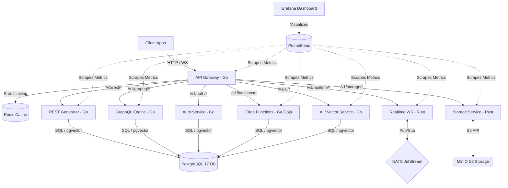

# NovaBase

[](LICENSE)
[](https://golang.org)
[](https://www.rust-lang.org)
[](https://www.docker.com)
[](packages/sdk-js)

**NovaBase** is an enterprise-grade, high-performance, open-source Backend-as-a-Service (BaaS) platform. Designed for developer efficiency, reliability, and speed, NovaBase wraps databases, real-time message brokers, serverless compute runtimes, S3 storage, and AI vector search engines into a unified API ecosystem.

---

## 🏛️ System Architecture

NovaBase is built using a highly decoupled microservices architecture. A central **API Gateway** intercepts all incoming client requests, manages authentication, rate limiting, and metrics, and routes requests to specialized, fast downstream services.



---

## 🚀 Key Services & Technologies

### 1. API Gateway (Go) — Port `8000`
The entry point of the entire stack.
*   **Routing**: Built with `go-chi/chi` to proxy routes downstream.
*   **Rate Limiting**: Implements a sliding-window algorithm backed by Redis.
*   **Authentication**: Centralized JWT signature validation and payload parsing.
*   **Metrics**: Exposes Prometheus metrics on `/metrics`.

### 2. Authentication Service (Go) — Port `8081`
Handles identity, secure session issuance, and user database management.
*   Uses `bcrypt` for secure password hashing.
*   Generates secure JWT access tokens for authorization.
*   Performs database migrations automatically on start.

### 3. Dynamic REST Generator (Go) — Port `8082`
Exposes dynamic CRUD endpoints over PostgreSQL tables.
*   Queries PostgreSQL schemas dynamically.
*   Auto-generates fully functional CRUD API endpoints for tables on-the-fly.

### 4. GraphQL Engine (Go) — Port `8087`
Auto-generates a GraphQL schema mapping to the underlying relational tables.
*   Supports standard GraphQL queries, mutations, and complex relation nesting.

### 5. Realtime Service (Rust) — Port `8083`
Highly concurrent WebSocket broadcast hub.
*   Written in **Rust** for maximum speed, memory safety, and thread concurrency.
*   Integrates with **NATS JetStream** for multi-node messaging pub/sub.
*   Clients can subscribe to channels and broadcast events in real-time.

### 6. Storage Service (Rust) — Port `8084`
S3-compatible bucket manager and file processing utility.
*   Interfaces with **MinIO** S3 backend.
*   Supports bucket creation, list, deletion, and multipart file upload.
*   **On-the-fly Image Manipulation**: Resizes/crops images in-memory using the `image` crate with the high-fidelity `Lanczos3` filter via URL query params (`?width=X&height=Y`).

### 7. Functions Service (Go) — Port `8085`
Isolated, serverless server-side JavaScript runtime.
*   Executes ES5.1 JavaScript code inside the process using [`goja`](https://github.com/dop251/goja) (pure Go JS engine).
*   Integrates JavaScript `console.log` directly into structured Go `slog` output.
*   Enforces a strict **10-second timeout** to protect resources against infinite loops.
*   Stores code definitions and metadata persistently in PostgreSQL.

### 8. AI / Vector Service (Go) — Port `8086`
Self-contained semantic search and vector indexing database.
*   Binds with PostgreSQL's `pgvector` extension for efficient cosine similarity calculations.
*   **Zero External API Dependencies**: Implements a deterministic, local 512-dimension bag-of-words hash embedding engine using unigram and character bigrams.
*   Supports Collection CRUD, document uploading, and top-k vector searches.

---

## 📊 Infrastructure Ports & Services

When the Docker Compose environment is started, the following mappings are exposed:

| Service | Host Port | Downstream Port | Description |
|---|---|---|---|
| **API Gateway** | `8000` | `8000` | Public REST/WS API Entrypoint |
| **Auth Service** | `8081` | `8081` | Microservice for Identity |
| **REST Generator** | `8082` | `8082` | Auto REST Endpoint Generator |
| **Realtime WebSockets** | `8083` | `8083` | Rust Realtime Subscribe/Publish |
| **Storage Service** | `8084` | `8084` | File uploads & resizing |
| **Functions Service** | `8085` | `8085` | JavaScript Serverless Engine |
| **AI Vector Service** | `8086` | `8086` | pgvector Semantic Engine |
| **GraphQL Engine** | `8087` | `8087` | Dynamic GraphQL endpoints |
| **PostgreSQL 17** | `5432` | `5432` | DB with `postgis`, `pgvector`, `pgcrypto` |
| **Redis** | `6379` | `6379` | Cache, Session, & Rate-limiting store |
| **NATS Broker** | `4222` / `8222` | `4222` / `8222` | Real-time Pub/Sub Messaging |
| **MinIO Console** | `9000` / `9001` | `9000` / `9001` | S3 Storage Engine & GUI Dashboard |
| **Prometheus** | `9090` | `9090` | System metrics scrapper |
| **Grafana** | `3000` | `3000` | Service Health Visualizer Dashboard |

---

## 🛠️ Getting Started

### Prerequisites
*   [Docker Desktop](https://www.docker.com/products/docker-desktop/) or Docker Engine with Docker Compose CLI v2.
*   Git command line tools.

### Running NovaBase
1.  **Clone this repository**:
    ```bash
    git clone https://github.com/RishabhKothiyal1/novabase.git
    cd novabase
    ```
2.  **Set up environment configuration**:
    ```bash
    cp .env.example .env
    ```
    *(For Windows PowerShell, use `Copy-Item .env.example .env`)*

3.  **Spin up all services**:
    ```bash
    docker compose up --build -d
    ```

4.  **Confirm health status**:
    ```bash
    docker compose ps
    ```
    Ensure all containers display `Up (healthy)`.

---

## 🧪 Testing and Verification

NovaBase features dedicated testing scripts located in the brain logs and scratchpads. Below are standard API commands to verify that all systems are operational:

### 1. Gateway Health Check
```bash
curl -s http://localhost:8000/v1/health
```

### 2. File Upload & On-the-fly Image Resizing
Upload a file to MinIO:
```bash
curl -s -X POST "http://localhost:8084/v1/storage/buckets/novabase-storage/upload" \
  -F "file=@your_image.png;filename=avatar.png"
```
Download the uploaded image resized to exactly 150x150 pixels:
```bash
curl -o resized_avatar.png "http://localhost:8084/v1/storage/buckets/novabase-storage/download/avatar.png?width=150&height=150"
```

### 3. Serverless Functions Execution
Deploy a function definition:
```bash
curl -s -X POST http://localhost:8085/v1/functions \
  -H "Content-Type: application/json" \
  -d '{
    "name": "greeter",
    "description": "Echo name",
    "code": "function handler(request) { var name = request.body.name || \"Guest\"; return { statusCode: 200, body: { msg: \"Hello \" + name } }; }"
  }'
```
Invoke it:
```bash
curl -s -X POST http://localhost:8085/v1/functions/greeter/invoke \
  -H "Content-Type: application/json" \
  -d '{"name": "Developer"}'
```

### 4. Vector AI Semantic Search
Create a Collection:
```bash
curl -s -X POST http://localhost:8086/v1/ai/collections \
  -H "Content-Type: application/json" \
  -d '{"name": "kb", "description": "Knowledge Base"}'
```
Index a document:
```bash
curl -s -X POST http://localhost:8086/v1/ai/collections/kb/documents \
  -H "Content-Type: application/json" \
  -d '{"content": "The Storage service processes images on the fly using a Lanczos3 filter."}'
```
Execute semantic similarity search:
```bash
curl -s -X POST http://localhost:8086/v1/ai/collections/kb/search \
  -H "Content-Type: application/json" \
  -d '{"query": "image resizing", "top_k": 1}'
```

---

## 🧰 JavaScript / TypeScript SDK

The official **`@novabase/sdk`** client library lives in [`packages/sdk-js/`](packages/sdk-js). It provides a fluent, typed interface for all NovaBase services and works in both **Node.js** and **browser** environments.

### Installation

```bash
cd packages/sdk-js
npm install
npm run build
```

### Quick Start

```typescript
import { NovaBaseClient } from '@novabase/sdk';

const client = new NovaBaseClient('http://localhost:8000');

// ── Auth ─────────────────────────────────────────────────────────────────────
await client.auth.signUp('user@example.com', 'password123');
const { session } = await client.auth.signIn('user@example.com', 'password123');

// ── REST Database ─────────────────────────────────────────────────────────────
// Insert a row
const post = await client.from('posts').insert({ title: 'Hello World' }).execute();

// Query with filters, ordering, and pagination
const posts = await client.from('posts')
  .select('*')
  .eq('published', true)
  .order('created_at', 'desc')
  .limit(10)
  .execute();

// Update rows matching a filter
await client.from('posts').update({ published: false }).eq('id', post.id).execute();

// Delete a row
await client.from('posts').delete().eq('id', post.id).execute();

// ── Storage ───────────────────────────────────────────────────────────────────
// Upload a file
const result = await client.storage.from('my-bucket').upload('avatar.png', fileBuffer, 'image/png');

// Download with on-the-fly image resize
const res = await client.storage.from('my-bucket').download('avatar.png', { width: 128, height: 128 });
const blob = await res.blob();

// ── Edge Functions ────────────────────────────────────────────────────────────
// Deploy a JavaScript function
await client.functions.deploy('greet', `
  function handler(request) {
    return { statusCode: 200, body: { msg: "Hello " + request.body.name } };
  }
`);

// Invoke it
const { body } = await client.functions.invoke('greet', { name: 'World' });
console.log(body.msg); // "Hello World"

// ── AI / Vector Search ────────────────────────────────────────────────────────
// Create a collection and index documents
await client.ai.createCollection('docs', 'My knowledge base');
await client.ai.collection('docs').addDocument('Storage resizes images with Lanczos3 filter.', { topic: 'storage' });
await client.ai.collection('docs').addDocument('Auth uses bcrypt and JWT for sessions.', { topic: 'auth' });

// Semantic similarity search
const { results } = await client.ai.collection('docs').search('image processing', 1);
console.log(results[0].content); // "Storage resizes images…"

// ── Realtime WebSockets ───────────────────────────────────────────────────────
const channel = client.realtime.channel('chat-room');

// Subscribe to messages
const { unsubscribe } = channel.subscribe((payload) => {
  console.log('New message:', payload.data);
});

// Broadcast a message
channel.broadcast({ text: 'Hello everyone!' });

// Clean up
unsubscribe();
client.realtime.disconnect();
```

---

## 📜 License

NovaBase is open-source software licensed under the [MIT License](LICENSE).
